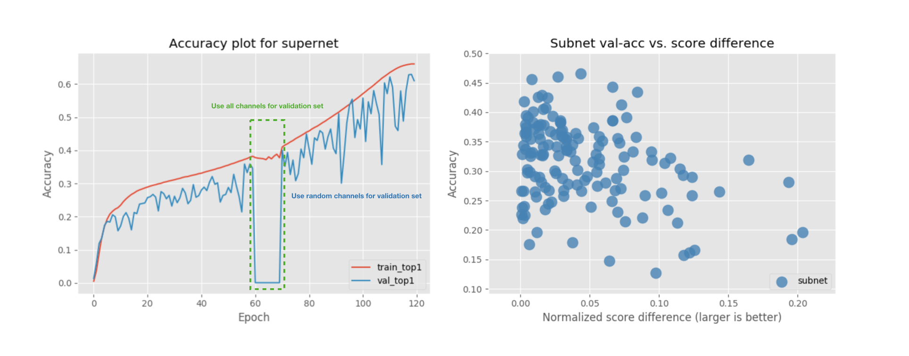
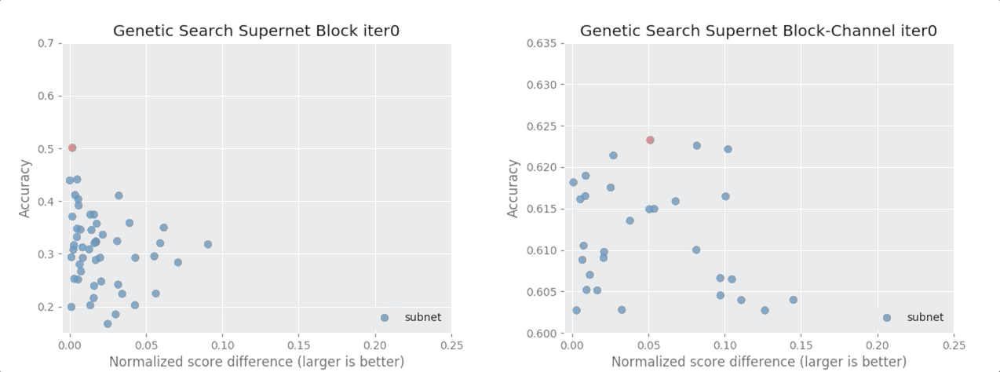

# Abstract

Designing convolutional neural networks (CNN) for mobile devices is challenging because mobile models need to be small and fast, yet still accurate. Although significant efforts have been dedicated to design and improve mobile CNNs on all dimensions, it is very difficult to manually balance these trade-offs when there are so many architectural possibilities to consider. In this work, we provided an open-sourced weight sharing Neural Architecture Search (NAS) pipeline, which can be **trained and searched on ImageNet totally within 60 GPU hours** (on 4 V100 GPUS) **in the exploration space of about 32^20 choices**.

This implementation searched a new state-of-the-art subnet model outperforming Single Path One Shot, FBNet,MnasNet, DARTS, NASNET, PNASNET by a good margin in all factors of FLOPS, # of parameters and Top-1 accuracy. Also for considering the MicroNet Challenge Σ score, without any quantization, it outperforms MobileNet V2, V3, ShuffleNet V1, V2, V2+ too.

# Our approach

Our approach is **mainly based on the Single Path One Shot NAS in combination of Squeeze and Excitation (SE), ShuffleNet V2+ and MobileNet V3**. Like the original paper, we searched for the choice blocks and block channels with multiple FLOPs and # of parameters constraints. In this section, we will elaborate the modifications from the original paper.

## Supernet Structure Design

For each ShuffleNasBlock (SNasB), four choice blocks were explored, ShuffleNetBlock-3x3 (SNB-3), SNB-5, SNB-7 and ShuffleXceptionBlock-3x3 (SXB-3). Within each block, eight channel choices are avialable: [0.6, 0.8, 1.0, 1.2, 1.4, 1.6, 1.8, 2.0] x (BlockOutputChannel / 2). So each SNasB block explores 32 possible choices and there are 20 blocks in this implementation, counting for totaly 32^20 design choices.

We also applied the SE, ShuffleNet V2+ SE layout and the MobileNet V3 last convolution block design in the supernet. Finally, the supernet contains 15.4 Million trainable parameters and the subnet FLOPs ranges from 168M to 841M.

## Supernet Training

Unlike what the original paper did, in the training stage, we didn't apply uniform distribution from the begining. We train the supernet totaly 120 epochs. In the first 60 epochs doing Block selection only and, for the upcoming 60 epochs, we used Channel Selection warm-up which gradually allows the supernet to be trained with larger range of channel choices.

``` python
   # Supernet sampling schedule: during channel selection warm-up, apply more epochs for [0.2, 0.4, 0.6, 0.8, 1.0] channel choices
   1 - 60 epochs:          Only block selection (BS)
   61 epoch:               [1.8, 2.0] + BS
   62 epoch:               [1.6, 1.8, 2.0] + BS
   63 epoch:               [1.4, 1.6, 1.8, 2.0] + BS
   64 epoch:               [1.2, 1.4, 1.6, 1.8, 2.0] + BS
   65 - 66 epochs:         [1.0, 1.2, 1.4, 1.6, 1.8, 2.0] + BS
   67 - 69 epochs:         [0.8, 1.0, 1.2, 1.4, 1.6, 1.8, 2.0] + BS
   70 - 73 epochs:         [0.6, 0.8, 1.0, 1.2, 1.4, 1.6, 1.8, 2.0] + BS 
   74 - 78 epochs:         [0.4, 0.6, 0.8, 1.0, 1.2, 1.4, 1.6, 1.8, 2.0] + BS 
   79 - 120 epochs:        [0.2, 0.4, 0.6, 0.8, 1.0, 1.2, 1.4, 1.6, 1.8, 2.0] + BS
```

The reason why we did this in the supernet training is that, during our experiments, we found:
> 1. For supernet without SE, doing block selection alone in the first n epochs and using Channel Selection warm-up are necessary to make the model converge. Otherwise it wouldn't converge at all.
> 2. For supernet with SE, Channel Selection with the full choices (0.2 ~ 2.0) can be used at the first epoch and it converges.
>    - However, doing Channel Selection from the first epoch seems like harming the accuracy. Compared to the same se-supernet with first n epoch block selection alone and --cs-warm-up, the channel selection from-scratch se-supernet only reached ~33% training accuracy and the warmed up se-supernet reaches ~44%, both at ~70th epoch.
>    - Another thing is that validation accuracy in the channel selection from-scratch se-supernet is always under 1%, while the warmed up se-supernet's validation accuracy looks reasonably increasing from 0.1% to 63%.

## Subnet Searching

Different from the paper, we jointly searched for the Block choices and Channel Choices in the supernet at the same time. It means that, for each instance in the population of our genetic algorithm, it contains 20 Block choices gene and 20 Channel choices gene. We were aiming to find a combination of these two which optimizing for the both and being Complementary.

The details of our genetic search are also not identical to the original paper, here is how we implemented:

> Initial population P0 = 50
> 
> random_select_ratio = 0.1
> 
> mutate_ratio = 0.1

For each sampled subnet structure passing the constraint, like most weight sharing NAS approaches did, we updated the BN statistics firstly with 20,000 fixed (or random, this doesn't influence much) training set images and then evalute this subnet ImageNet validation accuracy as the indicator for its performance.


## Subnet Training

For the final searched model, we build and train it from scratch. No previous supernet weights are reused in subnet.

As for the hyperparameters. We modified the GluonCV official ImageNet training script to support both supernet training and subnet training. We trained both models with initial learning rate 1.3, weight decay 0.00003, cosine learning rate scheduler, 4 GPUs each with batch size 256, label smoothing and no weight decay for BN beta gamma. Supernet was trained 120 epochs and subnet was trained 360 epochs. 


# Results

## Supernet Training


As we claimed in [here], we did Block selection only in the first 60 epochs and strating from 61 epoch, we gradually allow larger range of channel choices to be sampled and used. To explain the accuracy drop between [60, 70] epochs, we need to understand there is a difficulty in evaluating the supernet performance. During training, we sampled a random combination of Block Choices and Channel Choices per batch and it results in that we only trained (120 epochs * 1,280,000 images per epoch) / 1024 batch size -> 150,000 possible subnet structures over 32^20. 

If we also sample random Blocks and Channels for validation set per batch, each validation batch subnet structure is highly unlikely being seen during training. So we tried to fix the Block & Channel choices (do random block selection but all channel choices are set to be maximum) for the validation set between epoch [60, 70]. It doesn't work well so that we change back to do random samplingfor both. This random sampling for validation set surprisingly worked well. 

## Supernet Searching


We tried both random search, random selecting 250 qualified instance to evaluate their performance, and genetic search. The genetic method easily found a better subnet structure over the random selection.

## Searched Model Performance

| Model                  | FLOPs | # of Params   | Top - 1 | Top - 5 | [Σ Normalized Scores](https://micronet-challenge.github.io/scoring_and_submission.html) | Scripts | Logs |
| :--------------------- | :-----: | :------:  | :-----: | :-----: | :---------------------: | :-----: |  :-----: | 
|    OneShot+ Supernet |  841.9M  |  15.4M  |  62.90   |   84.49   | 7.09 | [script](https://github.com/CanyonWind/oneshot_nas/blob/master/scripts/train_supernet.sh) | [log](https://github.com/CanyonWind/oneshot_nas/blob/master/logs/shufflenas_supernet.log) |
|    OneShot-S+ |  291M |  3.5M |  **75.52**   |   **92.66**   | **1.9166** | [script](https://github.com/CanyonWind/oneshot_nas/blob/master/scripts/train_fixArch%2B.sh) | [log](https://github.com/CanyonWind/oneshot_nas/blob/master/logs/shufflenas_oneshot%2B.log) |
|    OneShot (our) |  328M |  3.4M |  74.02   |   91.60   | 2 | [script](https://github.com/CanyonWind/oneshot_nas/blob/master/scripts/train_fixArch.sh) | [log](https://github.com/CanyonWind/MXNet-Single-Path-One-Shot-NAS/blob/master/logs/shufflenas_oneshot.log) |
|    OneShot (official) |  328M |  3.4M |  74.9   |   92.0   | 2 | - | - |
|    FBNet-B|  295M|  4.5M |  74.1   |   -   | 2.19 | - | - |
|    MnasNet|  317M |  4.2M |  74.0   |  91.8   | 2.20 | - | - |
|    MobileNetV3 Large|	 **217M** |	5.4M |	75.2|	- | 2.25 | - | - |
|    DARTS|  574M|  4.7M |  73.3   |   91.3  | 3.13 | - | - |
|    NASNET-A|  564M |  5.3M |  74.0   |   91.6   | 3.28 | - | - |
|    PNASNET|  588M |  5.1M |  74.2   |   91.9   | 3.29 | - | - |
|    MobileNetV2 (1.4) |	585M |	6.9M |	74.7 |	- | 3.81 | - | - |

 
## Searched Model Profiling

|op_name                                   | inp_size  |  kernel_size   | in channels |  out channels |  params(MBytes) |   mults(M)  |   adds(M)  |    MFLOPS| 
|:-----:                                   | :-----:  | :-----:   | :-----:|  :-----: |  :-----: |   :-----:  |   :-----: |   :-----:| 
|first_conv_fwd                            |      224 |            3       |      3       |     16       |    0.001   |   5.419    |  5.218   |  10.637|

# Summary
In this work, we provided an state-of-the-art open-sourced weight sharing Neural Architecture Search (NAS) pipeline, which can be trained and searched on ImageNet totally within 60 GPU hours (on 4 V100 GPUS) and the exporation space is about 32^20. The model searched by this implementation outperforms Single Path One Shot, FBNet, MnasNet, DARTS, NASNET, PNASNET by a good margin in all factors of FLOPS, # of parameters and Top-1 accuracy. Also for considering the MicroNet Challenge Σ score, without any quantization, it outperforms MobileNet V2, V3, ShuffleNet V1, V2, V2+.
