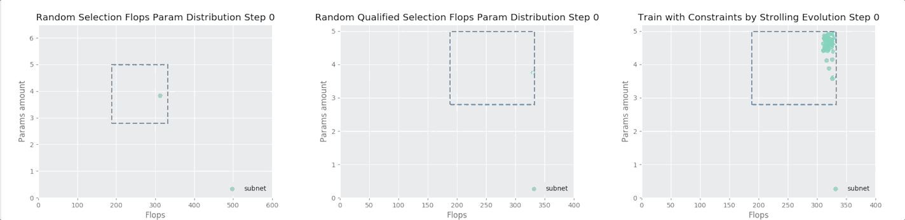

# [Single Path One Shot NAS MXNet](https://arxiv.org/abs/1904.00420)
# [](https://paperswithcode.com/sota/neural-architecture-search-on-imagenet?p=single-path-one-shot-neural-architecture)

This repository contains Single Path One-shot NAS implementation on **MXNet (Gluon)**. It can finish **the whole training and searching pipeline on ImageNet within `60` GPU hours** (on 4 V100 GPUs, including supernet training, supernet searching and the searched best subnet training) **in the exploration space of about `32^20` choices**. By utilizing this implementation, a new state-of-the-art NAS searched model has been found which **outperforms** other NAS models like `FBNet, MnasNet, DARTS, NASNET, PNASNET and the original SinglePathOneShot` by a good margin in all factors of FLOPs, parameters amount and top-1/5 accuracies. Also for considering [Google's MicroNet Challenge Σ Normalized Scores](https://micronet-challenge.github.io/scoring_and_submission.html), before any quantization, it **outperforms** other popular handcrafted efficient models like `MobileNet V1 V2, V3, ShuffleNet V1, V2` too.


**11/12/2019 Update:** 

Single Path One Shot NAS author has released [their Supernet Training and Searching codes](https://github.com/megvii-model/SinglePathOneShot). The comparison table between the official version and this repo's implementation has been updated. Check [here](https://github.com/CanyonWind/Single-Path-One-Shot-NAS-MXNet#comparision-to-the-official-release) for more details.

**10/09/2019 Update:** 

A searched model **Oneshot-S+**, with the block choices and channel choices searched by this repo's implementation, ShuffleNetV2+ style SE and MobileNetV3 last convolution block design, reaches the **new highest** top-1 & top-5 accuracies with the **new lowest** [Google MicroNet Challenge Σ Normalized Scores](https://micronet-challenge.github.io/scoring_and_submission.html) among other NAS searched or popular handcrafted efficient models. Check [here](https://github.com/CanyonWind/oneshot_nas#results) for comparison.

**09/30/2019 Update:** 

A customized model **Oneshot+**, with the block choices and channel choices provided from paper, ShuffleNetV2+ style SE and MobileNetV3 last convolution block design, reaches the highest top-1 & top-5 accuracies with the lowest [Google MicroNet Challenge Σ Normalized Scores](https://micronet-challenge.github.io/scoring_and_submission.html) among other NAS searched or popular handcrafted efficient models. Check [here](https://github.com/CanyonWind/oneshot_nas#results) for comparison.

| NAS Model                  | FLOPs | # of Params   | Top - 1 | Top - 5 | [Σ Normalized Scores](https://micronet-challenge.github.io/scoring_and_submission.html) | Scripts | Logs |
| :--------------------- | :-----: | :------:  | :-----: | :-----: | :---------------------: | :-----: |  :-----: | 
|    OneShot+ Supernet |  841.9M  |  15.4M  |  62.90   |   84.49   | 7.09 | [script](https://github.com/CanyonWind/oneshot_nas/blob/master/scripts/train_supernet.sh) | [log](https://github.com/CanyonWind/oneshot_nas/blob/master/logs/shufflenas_supernet.log) |
|    OneShot-S+ (ours) |  291M |  3.5M |  **75.75**   |   **92.77**   | **1.9166** | [script](https://github.com/CanyonWind/MXNet-Single-Path-One-Shot-NAS/blob/master/scripts/train_oneshot-s+.sh) | [log](https://github.com/CanyonWind/oneshot_nas/blob/master/logs/shufflenas_oneshot%2B.log) |
|    OneShot+ (ours) |  297M |  3.7M |  **75.24**   |   **92.58**   | **1.9937** | [script](https://github.com/CanyonWind/MXNet-Single-Path-One-Shot-NAS/blob/master/scripts/train_oneshot+.sh) | [log](https://github.com/CanyonWind/oneshot_nas/blob/master/logs/shufflenas_oneshot%2B.log) |
|    OneShot (ours) |  328M |  3.4M |  74.02*   |   91.60   | 2 | [script](https://github.com/CanyonWind/oneshot_nas/blob/master/scripts/train_oneshot.sh) | [log](https://github.com/CanyonWind/MXNet-Single-Path-One-Shot-NAS/blob/master/logs/shufflenas_oneshot.log) |
|    OneShot (official) |  328M |  3.4M |  74.9*   |   92.0   | 2 | - | - |
|    FBNet-B|  295M|  4.5M |  74.1   |   -   | 2.19 | - | - |
|    MnasNet|  317M |  4.2M |  74.0   |  91.8   | 2.20 | - | - |
|    DARTS|  574M|  4.7M |  73.3   |   91.3  | 3.13 | - | - |
|    NASNET-A|  564M |  5.3M |  74.0   |   91.6   | 3.28 | - | - |
|    PNASNET|  588M |  5.1M |  74.2   |   91.9   | 3.29 | - | - |

*According to [this issue](https://github.com/megvii-model/ShuffleNet-Series/issues/5), the official released model has been trained  multiple times with the reported top-1 accuracy ranging `[74.1 ~ 74.9]`. Others using the official pytorch release have obtained accuracies ranging `[73.7 ~ 73.9]`. All models in this repo's implementation have only been trained once. 

| Model                  | FLOPs | # of Params   | Top - 1 | Top - 5 | [Σ Normalized Scores](https://micronet-challenge.github.io/scoring_and_submission.html) | Scripts | Logs |
| :--------------------- | :-----: | :------:  | :-----: | :-----: | :---------------------: | :-----: |  :-----: | 
|    OneShot-S+ (ours) |  291M |  3.5M |  **75.75**   |   **92.77**   | **1.9166** | [script](https://github.com/CanyonWind/MXNet-Single-Path-One-Shot-NAS/blob/master/scripts/train_oneshot-s+.sh) | [log](https://github.com/CanyonWind/oneshot_nas/blob/master/logs/shufflenas_oneshot%2B.log) |
|    OneShot+ (ours) |  297M |  3.7M |  **75.24**   |   **92.58**   | **1.9937** | [script](https://github.com/CanyonWind/MXNet-Single-Path-One-Shot-NAS/blob/master/scripts/train_oneshot+.sh) | [log](https://github.com/CanyonWind/oneshot_nas/blob/master/logs/shufflenas_oneshot%2B.log) |
|    OneShot (ours) |  328M |  3.4M |  74.02   |   91.60   | 2 | [script](https://github.com/CanyonWind/oneshot_nas/blob/master/scripts/train_oneshot.sh) | [log](https://github.com/CanyonWind/MXNet-Single-Path-One-Shot-NAS/blob/master/logs/shufflenas_oneshot.log) |
|    MobileNetV3 Large|	 **217M** |	5.4M |	75.2 |	-  | 2.25 | - | - |
|    MobileNetV2 (1.4) |	585M |	6.9M |	74.7 |	-  | 3.81 | - | - |
|    MobileNetV1       |	569M |   4.2M |   70.6 |   -  | 2.97   | - | - |
|    ShuffleNetV2 2.0x  |  591M |   7.4M |   75.0 | 92.4 | 3.98    | - | - |
|    ShuffleNetV1 2.0x  |	524M |	5.4M |	74.1 | 91.4  |  3.19  | - | - |


## Comparision to [the official release](https://github.com/megvii-model/SinglePathOneShot)

Single Path One Shot NAS provides an elegent idea to effortlessly search for optimized subnet structures, under different model size/latency constraints, with single time supernet training and multiple times low-cost searching procedures. **The flexibility and efficiency of this approach can benefit to many pratical senarios where a neural network model needs to be deployed across platforms**. With the aid of this approach, manually tuning the structures to meet different hardware constraits can be avoided. Unfortunately, the author hasn't released the full Supernet Training and Searching parts yet. This repo makes up for the missing of them.


| Model                                 | Official    | This repo  |
| :------------------------------------ | :------     | :------    |
| Subnet Training                       | √           | √          |
| Block Selection                       | √           | √          |
| Channel Selection                     | ×           | √          |
| Supernet Training - With Block Choices| √           | √          |
| Supernet Training - With Channel Choices | ×           | √          |
| Supernet Training - With FLOP/Param Constraints  | ×           | √          |
| Supernet Training - With [Strolling Evolution Constraints](https://github.com/CanyonWind/Single-Path-One-Shot-NAS-MXNet#train-with-constraints)  | -           | √          |
| General FLOPs & Parameters Counting Tool | √           | √          |
| Fast Counting Tool with pre-calculated lookup table  | ×           | √          |
| BN Stat Update for Val Acc            | ×           | √          |
| BN Stat Update for Supernet Searching | ×           | √          |
| Random Search                         | ×           | √          |
| Genetic Search - On Block Choices     | √           | √          |
| Genetic Search - On Channel Choices   | ×           | √          |
| Genetic Search - Jointly              | ×           | √          |
| SE                                    | -           | √          |
| Efficient Last Conv Block             | -           | √          |
| Op to Op Profiling Tool               | -           | √          |
| Merge BN                              | -           | √          |
| Int8 Quantization                     | -           | √          |


# Usage
Download the ImageNet dataset, reorgnize the raw data and create MXNet RecordIO files (or just put the validation images in its corresponding class folder) by following [this script](https://gluon-cv.mxnet.io/build/examples_datasets/imagenet.html#prepare-the-imagenet-dataset). 

Set up the environments.
```shell
python3 -m pip install --user --upgrade pip
python3 -m pip install --user virtualenv
python3 -m venv env

source env/bin/activate
pip install -r requirements.txt
```

Train & search
```
# Train supernet
sh ./scripts/train_supernet.sh

# Search supernet
sh ./scripts/search_supernet.sh

# Train best searched model
sh ./scripts/train_oneshot.sh
```

Detailed usage for training and searching can be found [here](https://github.com/CanyonWind/Single-Path-One-Shot-NAS-MXNet/blob/master/logs/train_search_options.md).

# Approach breakdown

Our approach is **mainly based on the Single Path One Shot NAS in the combination of Squeeze and Excitation (SE), ShuffleNet V2+ and MobileNet V3**. Like the original paper, we searched for the choice blocks and block channels with multiple FLOPs and parameter amount constraints. In this section, we will elaborate on the modifications from the original paper.

## Supernet Structure Design

For each `ShuffleNasBlock`, four choice blocks were explored, `ShuffleNetBlock-3x3 (SNB-3)`, `SNB-5`, `SNB-7` and `ShuffleXceptionBlock-3x3 (SXB-3)`. Within each block, eight channel choices are avialable: `[0.6, 0.8, 1.0, 1.2, 1.4, 1.6, 1.8, 2.0] * (BlockOutputChannel / 2)`. So each `ShuffleNasBlock` explores `32` possible choices and there are `20` blocks in this implementation, counting for totaly `32^20` design choices.

We also applied the SE, ShuffleNet V2+ SE layout and the MobileNet V3 last convolution block design in the supernet. Finally, the supernet contains `15.4` Million trainable parameters and the possible subnet FLOPs range from `168M` to `841M`.

## Supernet Training

Unlike what the original paper did, in the training stage, we didn't apply uniform distribution from the beginning. We train the supernet totally `120` epochs. In the first `60` epochs doing Block selection only and, for the upcoming `60` epochs, we used **Channel Selection Warm-up** which gradually allows the supernet to be trained with a larger range of channel choices.

``` python
   # Supernet sampling schedule: during channel selection warm-up
   1 - 60 epochs:          Only block selection (BS), Channels are set to maximum (here [2.0])
   61 epoch:               [1.8, 2.0] + BS
   62 epoch:               [1.6, 1.8, 2.0] + BS
   63 epoch:               [1.4, 1.6, 1.8, 2.0] + BS
   64 epoch:               [1.2, 1.4, 1.6, 1.8, 2.0] + BS
   65 - 66 epochs:         [1.0, 1.2, 1.4, 1.6, 1.8, 2.0] + BS
   67 - 69 epochs:         [0.8, 1.0, 1.2, 1.4, 1.6, 1.8, 2.0] + BS
   70 - 73 epochs:         [0.6, 0.8, 1.0, 1.2, 1.4, 1.6, 1.8, 2.0] + BS 
```

The reason why we did this in the supernet training is that during our experiments we found, **for supernet without SE**, doing Block Selection from beginning works well, nevertheless doing Channel Selection from the beginning will cause the network not converging at all. The Channel Selection range needs to be gradually enlarged otherwise it will crash with free-fall drop accuracy. And the range can only be allowed for `(0.6 ~ 2.0)`. Smaller channel scales will make the network crashing too. **For supernet with SE**, Channel Selection with the full choices `(0.2 ~ 2.0)` can be used from the beginning and it converges. However, doing this seems like harming accuracy. Compared to the same se-supernet with Channel Selection warm-up, the Channel Selection from scratch model has been always left behind `10%` training accuracy during the whole procedure. 

## Train with Constraints



Another thing we need to consider is that **the subnet sample space during training might not be aligned with where the space being searched on during the searching stage**. For instance, if we are searching for the top performance models within `(190m ~ 330m)` FLOPs and `(2.8m ~ 5.0m)` # params, the target subnet FLOPs & Params should locate within the blue dotted rectangle shown above. 5000 subnet distributions are drawn here to compare the differences between three training settings: `1)` No constraint `2)` meet constraints with random sampling and `3)` meet constraints with strolling evolution.

If the supernet is **trained without constraints** (the left plot), about `2/3` of the trained subnets are not located in the target space and these samples might disturbe the final supernet's credibility. The sampled subnet performance from the supernet might not be able to accurately indicate each subnet's real performance.

If the supernet is **trained with constraints and these constraints are met by random samlping** (the middle plot), although all `5000` subnets are located in the target area now, the distribution is not even. Subnets in top left corner can possibly not even be trained once. Since that part hasn't been trained, their sampled performances from supernet can be misguidingly inaccurate neither.

If the supernet is **trained with constraints and these constraints are met by a controllable evolution method** (the right plot), named as strolling evolution since it's walking around in the target area, all `5000` subnets are now evenly distributed within the target space. Because most of the cases have been uniformly considered during the training, the supernet trained with this strolling evolution method could be more trustworthy when using it to sample the subnet's performance.


## Subnet Searching

Different from the paper, we **jointly searched** for the Block choices and Channel Choices in the supernet at the same time. It means that for each instance in the population of our genetic algorithm it contains `20` Block choice genes and `20` Channel choice genes. We were aiming to find a combination of these two which optimizing for each other and being complementary.

For each qualified subnet structure (has lower `Σ Normalized Scores` than the baseline OneShot searched model), like most weight sharing NAS approaches did, we updated the BN statistics firstly with `20,000` fixed training set images and then evaluate this subnet ImageNet validation accuracy as the indicator for its performance.


## Subnet Training

For the final searched model, we **build and train it from scratch**. No previous supernet weights are reused in the subnet.

As for the hyperparameters. We modified the GluonCV official ImageNet training script to support both supernet training and subnet training. We trained both models with initial learning rate `1.3`, weight decay `0.00003`, cosine learning rate scheduler, 4 GPUs each with batch size `256`, label smoothing and no weight decay for BN beta gamma. Supernet was trained `120` epochs and subnet was trained `360` epochs. 


# Results

## Supernet Training

| Model   | FLOPs | # of Params   | Top - 1 | Top - 5 | [Σ Normalized Scores](https://micronet-challenge.github.io/scoring_and_submission.html) | Scripts | Logs |
| :--------------------- | :-----: | :------:  | :-----: | :-----: | :---------------------: | :-----: |  :-----: | 
|    OneShot+ Supernet |  1684M  |  15.4M  |  62.9   |   84.5   | 3.67 | [script](https://github.com/CanyonWind/oneshot_nas/blob/master/scripts/train_supernet.sh) | [log](https://github.com/CanyonWind/oneshot_nas/blob/master/logs/shufflenas_supernet.log) |

## Supernet Searching


Two identical supernets have been trained and searched to verify whether we can directly search for the Block and Channel choices on the supernet trained without Channel Selection. **On the left**, the supernet is trained only with Block Selection but no Channel Selection. **On the right**, it is trained with both Block and Channel selections. These two supernets are searched with the same Block & Channel joint evolution method. The evolution method is indeed able to gradually find good candidates from the left supernet, with Block Selection alone. But the subnets sampled from the right supernet, trained with Block & Channel Selection, clearly contain higher accuracy range `(0.6 ~ 0.63)` than the left one `(0.2 ~ 0.6)`. 

## Searched Models Performance

| Model                  | FLOPs | # of Params   | Top - 1 | Top - 5 | [Σ Normalized Scores](https://micronet-challenge.github.io/scoring_and_submission.html) | Scripts | Logs |
| :--------------------- | :-----: | :------:  | :-----: | :-----: | :---------------------: | :-----: |  :-----: | 
|    OneShot+ Supernet |  841.9M  |  15.4M  |  62.90   |   84.49   | 7.09 | [script](https://github.com/CanyonWind/oneshot_nas/blob/master/scripts/train_supernet.sh) | [log](https://github.com/CanyonWind/oneshot_nas/blob/master/logs/shufflenas_supernet.log) |
|    OneShot-S+ |  291M |  3.5M |  **75.75**   |   **92.77**   | **1.9166** | [script](https://github.com/CanyonWind/MXNet-Single-Path-One-Shot-NAS/blob/master/scripts/train_oneshot-s+.sh) | [log](https://github.com/CanyonWind/oneshot_nas/blob/master/logs/shufflenas_oneshot%2B.log) |
|    OneShot+ |  297M |  3.7M |  **75.24**   |   **92.58**   | **1.9937** | [script](https://github.com/CanyonWind/MXNet-Single-Path-One-Shot-NAS/blob/master/scripts/train_oneshot+.sh) | [log](https://github.com/CanyonWind/oneshot_nas/blob/master/logs/shufflenas_oneshot%2B.log) |
|    OneShot (our) |  328M |  3.4M |  74.02   |   91.60   | 2 | [script](https://github.com/CanyonWind/oneshot_nas/blob/master/scripts/train_oneshot.sh) | [log](https://github.com/CanyonWind/MXNet-Single-Path-One-Shot-NAS/blob/master/logs/shufflenas_oneshot.log) |
|    OneShot (official) |  328M |  3.4M |  74.9   |   92.0   | 2 | - | - |
|    FBNet-B|  295M|  4.5M |  74.1   |   -   | 2.19 | - | - |
|    MnasNet|  317M |  4.2M |  74.0   |  91.8   | 2.20 | - | - |
|    DARTS|  574M|  4.7M |  73.3   |   91.3  | 3.13 | - | - |
|    NASNET-A|  564M |  5.3M |  74.0   |   91.6   | 3.28 | - | - |
|    PNASNET|  588M |  5.1M |  74.2   |   91.9   | 3.29 | - | - |
|    MobileNetV3 Large|	 **217M** |	5.4M |	75.2 |	-  | 2.25 | - | - |
|    MobileNetV2 (1.4) |	585M |	6.9M |	74.7 |	-  | 3.81 | - | - |
|    MobileNetV1       |	569M |   4.2M |   70.6 |   -  | 2.97   | - | - |
|    ShuffleNetV2 2.0x  |  591M |   7.4M |   75.0 | 92.4 | 3.98    | - | - |
|    ShuffleNetV1 2.0x  |	524M |	5.4M |	74.1 | 91.4  |  3.19  | - | - |

## OneShot-S+ Profiling

A detailed op to op profiling can be found [here](https://github.com/CanyonWind/MXNet-Single-Path-One-Shot-NAS/blob/master/MicroNetChallenge/detailed_profiling.md). The calculation here follows MicroNet Challenge way. It's slightly different from how most paper reported FLOPs.

# Roadmap
- [x] Implement the fixed architecture model from the official pytorch release.
- [x] Implement the random block selection and channel selection.
- [x] Verify conv kernel gradients would be be updated according to ChannelSelector 
- [x] Make the fixed architecture model hybridizable.
- [x] Train a tiny model on Imagenet to verify the feasibility.
- [x] Modify the open source MXNet FLOP calculator to support BN
- [x] Verify that this repo's implementation shares the same # parameters and # FLOPs with the official one.
- [x] Add SE and hard swish in the model (on/off can be controlled by --use-se)
- [x] Add MobileNetV3 style last conv (on/off can be controlled by --last-conv-after-pooling)
- [x] Train the official fixed architecture model on Imagenet
- [x] Train the official uniform selection supernet model on Imagenet
    - [x] Add --use-all-blocks, --use-all-channels and --epoch-start-cs options for the supernet training.
    - [x] Add channel selection warm up: after epoch_start_cs, the channel selection range will be gradually increased.
    - [x] Train the supernet with --use-se and --last-conv-after-pooling --cs-warm-up
- [x] Build the evolution algorithm to search within the pretrained supernet model.
    - [x] Build random search
    - [x] update BN before calculating the validation accuracy for each choice
        - [x] Build and do unit test on the customized BN for updating moving mean & variance during inference
        - [x] Replace nn.batchnorm with the customized BN
    - [x] Evolution algorithm 
    - [x] Evolution algorithm with flop and # parameters constraint(s)
- [x] Quantization
    - [x] To eliminate the possibility that BN may cause quantization problem, add merge BN tool
    - [x] To eliminate the possibility that reshape may cause quantization problem, add ShuffleChannelByConv option
    - [x] Follow up on [this issue](https://github.com/apache/incubator-mxnet/issues/16424)
- [x] Search a model having both less FLOPs and # of parameters than MobileNet V3
    - [x] Add a searching mode which can specify hard FLOP and # of parameter constrains but not just the Σscores.
    - [x] Search within the OneShot supernet with provided stage channels, se and MobilNet V3 style conv
      - [x] This supernet setting cannot (quickly) find enough qualified candidates for population
    - [x] **In progress**: Train ShuffleNetV2+ channels layout supernet with se and MobilNet V3 style last convolution block.
    - [x] Train the best searched subnet model
- [x] Two stage searching
    - [x] Do Block search firstly
    - [x] Based on the best searched blocks, do channel search
- [ ] Estimate each (block, # channel) combination cpu & gpu latency
    - [x] Build a tool to generate repeating blocks
    - [ ] Estimate speeds for 4 choice blocks with different input/mid/output channels
- [x] More upcoming features/plans are moved into [the project section](https://github.com/CanyonWind/Single-Path-One-Shot-NAS-MXNet/projects) 


# Summary
In this work, we provided a state-of-the-art open-sourced weight sharing Neural Architecture Search (NAS) pipeline, which can be trained and searched on ImageNet totally within `60` GPU hours (on 4 V100 GPUS) and the exploration space is about `32^20`. The model searched by this implementation outperforms the other NAS searched models, such as `Single Path One Shot, FBNet, MnasNet, DARTS, NASNET, PNASNET` by a good margin in all factors of FLOPS, # of parameters and Top-1 accuracy. Also for considering the MicroNet Challenge Σ score, without any quantization, it outperforms `MobileNet V2, V3, ShuffleNet V1, V2`. This implementation can benefit to many pratical senarios where a neural network model needs to be deployed across platforms. With the aid of this approach, manually tuning the model structures to meet different hardware constraits can be avoided.


# Citation
If you use these models in your research, please cite the original paper.

    @article{guo2019single,
            title={Single path one-shot neural architecture search with uniform sampling},
            author={Guo, Zichao and Zhang, Xiangyu and Mu, Haoyuan and Heng, Wen and Liu, Zechun and Wei, Yichen and Sun, Jian},
            journal={arXiv preprint arXiv:1904.00420},
            year={2019}
    }
    
And references to the following BibTex entry would be appreciated too.

    @misc{yan2019sposmxnet,
          title={single-path-one-shot-mxnet},
          author={Kang, Yan},
          howpublished={\url{https://github.com/CanyonWind/Single-Path-One-Shot-NAS-MXNet}},
          year={2019}
    }
